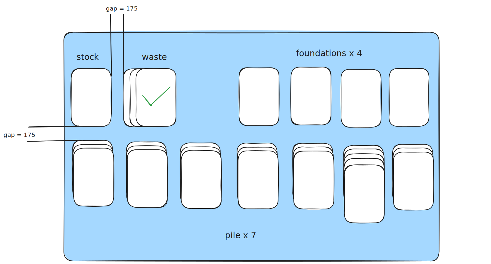

# klondike

[tutorial](https://docs.flame-engine.org/latest/tutorials/klondike/klondike.html)


## timeline

### 2025-04-24 00:49:54

卡牌设计：

- 1~13 * 4 = 52 张牌
- rank: 1~13
- suit: hearts ♥, diamonds ♦, clubs ♣, and spades ♠

代码设计采用了 enum 来表示，不过由于 enum 没法在初始化的时候绑定 sprite，所以这里采用了单例模式来实现 enum 的效果。

```dart
class Suit {
  factory Suit.fromInt(int index) {
    assert(
      index >= 0 && index <= 3,
      'index is outside of the bounds of what a suit can be',
    );
    return _singletons[index];
  }

  Suit._(this.value, this.label, double x, double y, double w, double h)
      : sprite = klondikeSprite(x, y, w, h);

  final int value;
  final String label;
  final Sprite sprite;

  static final List<Suit> _singletons = [
    Suit._(0, '♥', 1176, 17, 172, 183),
    Suit._(1, '♦', 973, 14, 177, 182),
    Suit._(2, '♣', 974, 226, 184, 172),
    Suit._(3, '♠', 1178, 220, 176, 182),
  ];
}
```


从sprite的区域中截取出需要的部分：[spritecow](http://www.spritecow.com/)


### 2025-04-24 00:16:35

卡牌尺寸：


布局尺寸：



anchor:

比如 Anchor.topCenter. 以这个方位作为不动点缩放

> The reason for such choice for the viewfinder’s position and anchor is because of how we want it to respond if the game size becomes too wide or too tall: in case of too wide we want it to be centered on the screen, but if the screen is too tall, we want the content to be aligned at the top.

### 2025-04-24 00:14:47

debug 会打印出调试信息，会显示尺寸

```dart
class Stock extends PositionComponent {
  @override
  bool get debugMode => true;
}
```

### 2025-04-21 02:39:11

动画效果: 

- [I recreated Balatro's effects in Godot](https://www.youtube.com/watch?v=Alwy-TH0WzE)
- [跟我用Godot实现了《小丑牌》中的3D卡牌效果](https://www.bilibili.com/video/BV1ni421y7no)

### 2025/04/21 01:38:54

游戏设计:

