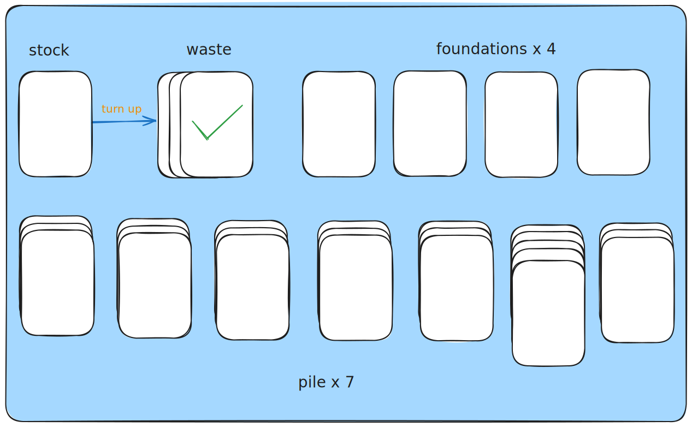

# klondike

[tutorial](https://docs.flame-engine.org/latest/tutorials/klondike/klondike.html)


## timeline

### 2025-04-24 00:16:35

尺寸设计：


anchor:

比如 Anchor.topCenter. 以这个方位作为不动点缩放

> The reason for such choice for the viewfinder’s position and anchor is because of how we want it to respond if the game size becomes too wide or too tall: in case of too wide we want it to be centered on the screen, but if the screen is too tall, we want the content to be aligned at the top.

### 2025-04-24 00:14:47

debug 会打印出调试信息，会显示尺寸

```dart
class Stock extends PositionComponent {
  @override
  bool get debugMode => true;
}
```

### 2025-04-21 02:39:11

动画效果: 

- [I recreated Balatro's effects in Godot](https://www.youtube.com/watch?v=Alwy-TH0WzE)
- [跟我用Godot实现了《小丑牌》中的3D卡牌效果](https://www.bilibili.com/video/BV1ni421y7no)

### 2025/04/21 01:38:54

游戏设计:

